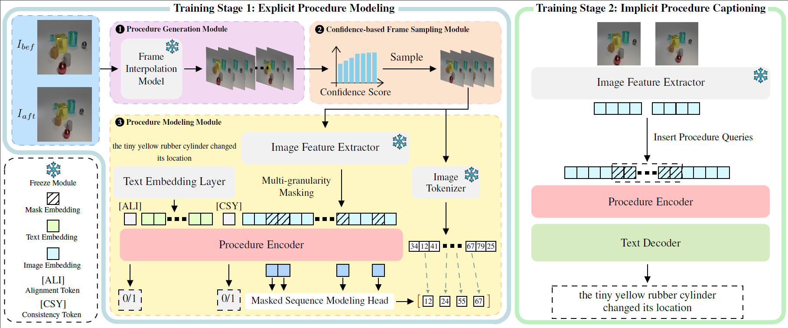

# Imagine How to Change: Explicit Procedure Modeling for Change Captioning

<div align="center">


*Figure 1: The proposed two-stage ProCap framework. (Left) Explicit Procedure Modeling stage. (Right) Implicit Procedure Captioning stage.*

[](https://iclr.cc/)
[](https://opensource.org/licenses/MIT)
[](https://www.python.org/)
[](https://pytorch.org/)
[](https://developer.nvidia.com/cuda-toolkit)

<!-- **Jiayang Sun**$^{*1}$, **Zixin Guo**$^{*2}$, **Min Cao**$^{\dagger1}$, **Guibo Zhu**$^{\dagger3}$, **Jorma Laaksonen**$^{2}$ -->

<!-- **Published at ICLR 2026** -->

</div>

## 📢 News
* **[2026-01-26]** The paper is accepted by **ICLR 2026**! 🎉
* **[2026-02-02]** 🚀 Code Release: We have released the full training and inference code for ProCap!
* **[Coming Soon]** 📦 Model Zoo: We are currently uploading the pre-trained checkpoints and processed datasets to Hugging Face and NetDisk. Stay tuned and star ⭐ our repo for updates!

## 🏠 Abstract
This repository contains the official implementation of the paper **"Imagine How to Change: Explicit Procedure Modeling for Change Captioning"**.

Change captioning generates descriptions that explicitly describe the differences between two visually similar images. Existing methods operate on static image pairs, thus ignoring the rich temporal dynamics of the change procedure.

We introduce **ProCap**, a novel framework that reformulates change modeling from static image comparison to dynamic procedure modeling. 
1.  **Explicit Procedure Modeling:** Trains a procedure encoder to learn the change procedure from a sparse set of keyframes obtained by interpolating and sampling intermediate frames.
2.  **Implicit Procedure Captioning:** Integrates the encoder within an encoder-decoder model, using learnable procedure queries to prompt the encoder for inferring the latent procedure representation.

Experiments on CLEVR-Change, Spot-the-Diff, and Image-Editing-Request demonstrate the effectiveness of ProCap.

## 🚀 TODO List
- [x] Release the paper.
- [x] Release the training and inference code.
- [ ] Release the pre-trained checkpoints (ProCap best models) and the processed datasets (CLEVR-Change, Spot-the-Diff, Image-Editing-Request).

## 🛠️ Installation

### Resource Access

All experimental materials, including **processed datasets** and **pre-trained weights**, are available for download at:
* [**Hugging Face**](https://huggingface.co/BlueberryOreo/ProCap) *(uploading)*
* [**Netdisk (Baidu):** ](https://pan.baidu.com/s/1t_YXB6J_vkuPxByn2hat2A)Extraction Code: 5h7w

Download OpenAI's pretrained CLIP model and place it under `./`

```bash
wget https://openaipublic.azureedge.net/clip/models/40d365715913c9da98579312b702a82c18be219cc2a73407c4526f58eba950af/ViT-B-32.pt
```

### Prerequisites

* **Python** >= 3.10
* **PyTorch** >= 2.5.1
* **CUDA** >= 12.4

### Environment Setup
We strongly recommend using **Anaconda** to create a new environment:

```bash
conda create -n ProCap python=3.10 -y
conda activate ProCap
```

### Install
```bash
git clone https://github.com/BlueberryOreo/ProCap.git
cd ProCap

pip install -r requirements.txt
```

## 📂 Data Preparation

Please refer to [data](./data/README.md) for detailed instructions on dataset preparation. 

## 🚀 Training

### Stage 1: Explicit Procedure Modeling

The training weights will be saved to `logs/`.

Note: Please download the pretrained VQGAN models, rename the directory to `pretrained_vqgan`, and place it in the project root directory. Please download confidence scores (computed by pretrained [CLIP4IDC](https://github.com/sushizixin/CLIP4IDC)), rename the directory to `filter_files`, and place it in the project root directory. 

```bash
# CLEVR
bash scripts/train_clevr_stage1.sh

# Spot
bash scripts/train_spot_stage1.sh

# Edit
bash scripts/train_edit_stage1.sh
```

The corresponding checkpoints can be found on Hugging Face and Netdisk.

### Stage 2: Implicit Procedure Captioning

Configs can be found in `configs/`. The results will be saved to `logs/`.

```bash
# CLEVR
bash scripts/train_clevr_stage2.sh

# Spot
bash scripts/train_spot_stage2.sh

# Edit
bash scripts/train_edit_stage2.sh
```

The corresponding checkpoints can be found on Hugging Face and Netdisk.

## 📊 Evaluation

Download [densevid_eval](https://github.com/jamespark3922/densevid_eval) from Hugging Face or Netdisk, and place it to the repository directory. Run the following scripts to evaluate the models:

```bash
# CLEVR
bash scripts/eval_clevr.sh

# Spot
bash scripts/eval_spot.sh

# Edit
bash scripts/eval_edit.sh
```

## 📖 Citation
If you find our work or this repository useful, please consider citing our paper:

```bibtex
@inproceedings{
  sun2026imagine,
  title={Imagine How To Change: Explicit Procedure Modeling for Change Captioning},
  author={Sun, Jiayang and Guo, Zixin and Cao, Min and Zhu, Guibo and Laaksonen, Jorma},
  booktitle={The Fourteenth International Conference on Learning Representations},
  year={2026},
}
```

## Acknowledgement

Our codebase is built upon [MMVID](https://github.com/snap-research/MMVID), [taming-transformers](https://github.com/CompVis/taming-transformers) and [CLIP4IDC](https://github.com/sushizixin/CLIP4IDC). We would like to thank the authors for their excellent open-source contributions.